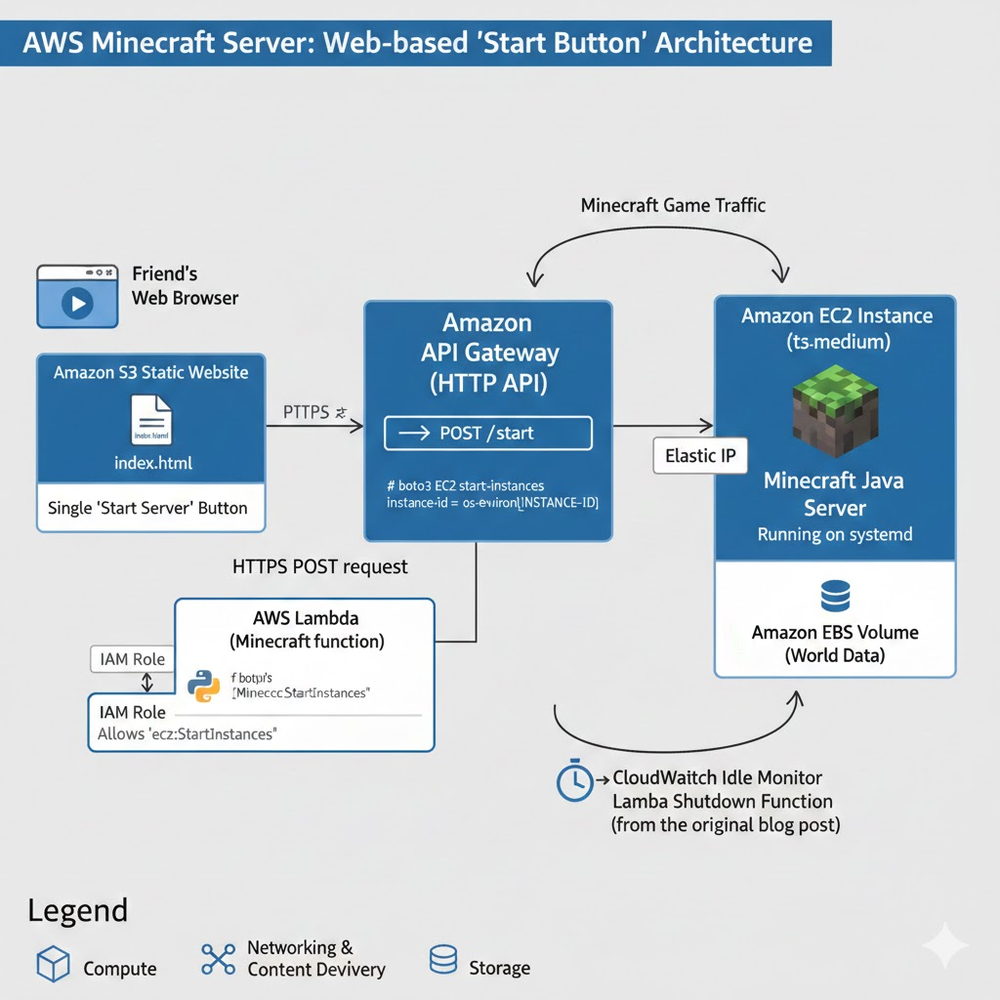

# minecraft-wake-web

This Terraform project is intended to create infrastructure for a cost-optimized Minecraft Java server on AWS EC2 that can be started and stopped via a public API Gateway endpoint and using AWS Systems Manager (SSM) to manage the EC2 instance.

## References

The following two AWS blog posts are used as direct references for creating the AWS EC2 minecraft server and using SSM to start and stop the server:

1. https://aws.amazon.com/blogs/gametech/setting-up-a-minecraft-java-server-on-amazon-ec2/
2. https://aws.amazon.com/blogs/gametech/cost-optimize-your-minecraft-java-ec2-server/

## Services

The following services are used in this project:
1. AWS EC2 - To host the Minecraft server.
2. AWS Systems Manager (SSM) - To manage the EC2 instance and run commands to start/stop the server.
3. AWS API Gateway - To create a public API endpoint to trigger the start/stop commands.
4. AWS IAM - To create roles and policies for SSM and API Gateway access.
5. AWS S3 - To host a simple static website for the API documentation.
6. AWS CloudWatch - To log API Gateway requests and Lambda function logs.
7. AWS Lambda - To handle the EC2 start

## Inaccurate Architecture Diagram

Here is a terrible  and inaccurate architecture diagram created by Generative AI:

